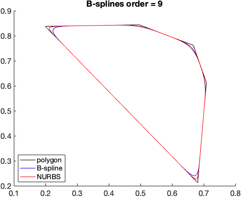

# Smoothing a polygon using B-splines/NURBS

Author: Bowei (Bobbie) Wu

All B-splines/NURBS evaluations in this code are done using the [B-splines MATLAB package](https://www.mathworks.com/matlabcentral/fileexchange/27374-b-splines) by [Levente Hunyadi](https://www.mathworks.com/matlabcentral/profile/authors/1879353-levente-hunyadi).

## Usage

See `example_smooth_polygon.m` for how to use this code.



## Designing process


1. Define a polygon 

* $P =$ polygon vertices, 2-m matrix
* $p =$ polynomial degree of the B-spline

```matlab
% define polygon vertices
P = [ 0.1993 0.4965 0.6671 0.7085 0.6809;
    0.8377 0.8436 0.7617 0.6126 0.212];
p = 8; % polynomial degree
n = p + 1;  % some call this the order of B-spline
```

2. Add points to each edge of the polygon, the number of subdivisions on each edge is proportional to its length.

```matlab
% uniform parameterization (put extra points on each edge)
P_temp = [P, P(:,1)];
len = sqrt(sum(diff(P_temp,1,2).^2,1)); % lengths of polygon edges
nsubdiv = round(len / min(len) * 3); % how many subdivisions on each edge
P_fine = []; % record the refined polygon
for i = 1:size(P_temp,2)-1
    P1_fine = linspace(P_temp(1,i),P_temp(1,i+1),nsubdiv(i)+1);
    P2_fine = linspace(P_temp(2,i),P_temp(2,i+1),nsubdiv(i)+1);
    P_fine = [P_fine, [P1_fine(1:end-1); P2_fine(1:end-1)]];
end
P = P_fine;
```

3. Assign weights $w_i$ to the vertices $P_i$ according to their exterior angles $\theta_i$. Specifically, define $w_i = w(\theta_i)$ where

$$
w(\theta) = \left(\frac{\theta/\pi + 1}{2}\right)^2\qquad\text{or}\qquad w(\theta) = \left(\frac{\theta/\pi + 1}{2}\right)^k\quad k\geq0
$$

so that $\theta=0$ corresponds to the smallest (nonzero) weight $w(0) = (1/2)^k$ and $\theta = \pi$ cooresponds to the biggest weight $w(\pi) = 1$. If $k=0$ (i.e. $w(\theta)\equiv1$) then it is not weighted.

> Remark 1: this will in fact create a Non-uniform Rational B-splines (NURBS) when $w\not\equiv 1$
>
> Remark 2: accute interior angles (i.e. large exterior angles) have higher weights, obtuse interior angles (i.e. small exterior angles) have lower weights.

```matlab
% weight of the vertices
w = zeros(1,size(P,2));
P_temp = [P(:,end), P, P(:,1)];
for i = 2:size(P_temp,2)-1
    u = P_temp(:,i) - P_temp(:,i-1);
    v = P_temp(:,i+1) - P_temp(:,i);
    
    theta = real(acos(dot(u,v)/(norm(u)*norm(v))));
    w(i-1) = ((theta/pi + 1)/2)^2;
end
% w = ones(1,size(P,2));
```

4. Create control points, account for periodicity (since a polygon is a closed curve). Periodically repeating the vertices $p$ more times.

```matlab
% periodicity (since a polygon is a closed curve)
ind = mod( (1:p)-1 , size(P,2) ) + 1; % periodic index
P = [P, P(:,ind)]; % extend control points for periodicity
w = [w, w(ind)]; % extend weights accordingly
```

5. Define the knot vector $t$ ($t_i$ is the preimage of vertex $P_i$ in the parameter space). Suppose there are $m$ vertices (periodically extended), then the knot vector $t = [t_1, t_2, \ldots, t_{m+p+1}]$ must have length $m+p+1$ and nondecreasing ($t_i\leq t_{i+1}$). 

> Remark 3: note that after constructing a B-spline $C(t_q)$ from $P$, parameterized by $t_q$, then the query points (parameter space) are defined as $t_{p+1} \leq t_q \leq t_{m+1}$.

There are two simplest choices

* $t = [1,2,\ldots,m+p+1]$ or $t_i = i$, then query points $p+1 \leq t_q \leq m+1$,
* $t_i = \frac{i - (p+1)}{m-p}$ normalized such that $0 \leq t_q \leq 1$.

```matlab
% define knot vector
m = size(P,2);
t = 1:m+n; % knot vector (query points tq satisfy n <= tq <= m+1 )
t = (t - n)/(m+1-n); % normalized knots (query points become 0 <= tq <= 1)
```

6. Evaluate the B-splines and there derivative (see below for how to compute the derivative).

```matlab
% B-splines evaluation

% define query points
% must satisfy t(p+1) <= tq <= t(m+1)
tq = linspace(t(n),t(end-p),1000); % just tq = linspace(0,1,1000) if normalized

% Evaluate the B-splines, require package by Hunyadi (2010)
Y = bspline_deboor(n,t,P,tq); % unweighted B-spline
X = bspline_wdeboor(n,t,P,w,tq); % weighted B-spline, aka NURBS

% b-spline derivative (unweighted)
[dt,dP] = bspline_deriv(n,t,P);
dtq = linspace(dt(n-1),dt(end-n+2),1000); % again 0 <= dtq <= 1 if normalized
dY = bspline_deboor(n-1,dt,dP,dtq);

% b-spline derivative (weighted, aka NURBS derivative)
dX = bspline_wdeboor_deriv(n,t,P,w,tq);
```

7. Plot the results

```matlab
% plot results
figure(1);
subplot(121);
hold on;
plot(Y(1,:), Y(2,:), 'b');
plot(X(1,:), X(2,:), 'r');
plot(P(1,:), P(2,:), 'k');
hold off;
title(['num of continuous derivative = ',num2str(p-1)])

subplot(122)
plot(tq,X(1,:),tq,dX(1,:))
% plot(dX(1,:), dX(2,:),'-o');
title(['x(t) and x''(t)'])
```

## Computing the derivative of NURBS

TBA. See `bspline_wdeboor_deriv.m` for implementation.